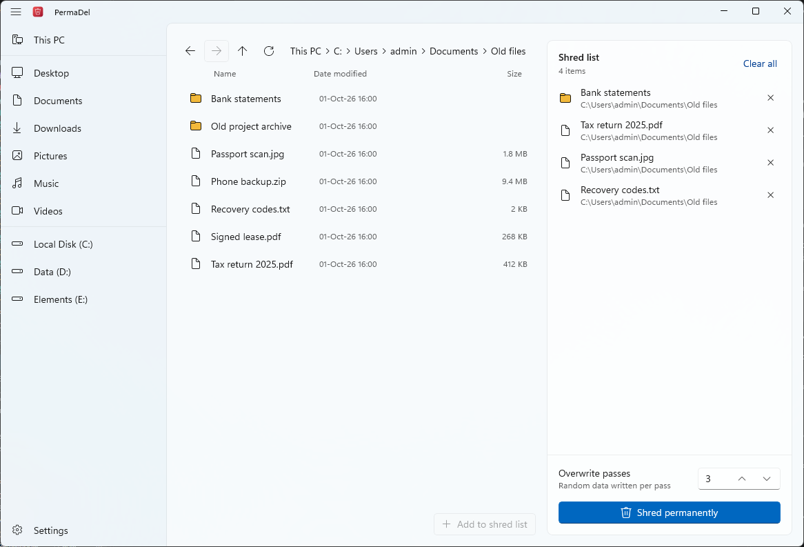
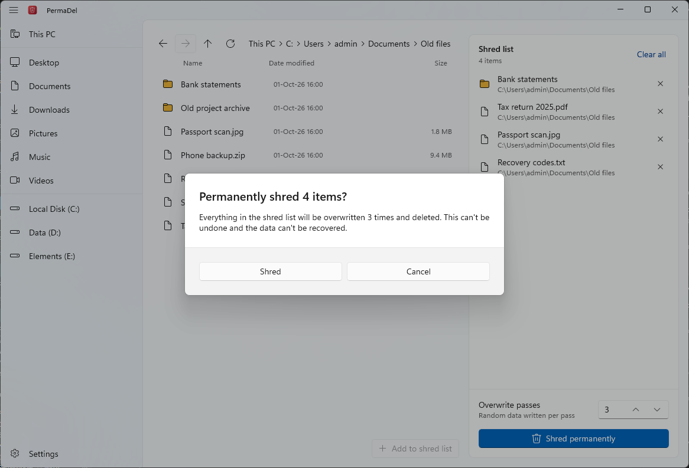
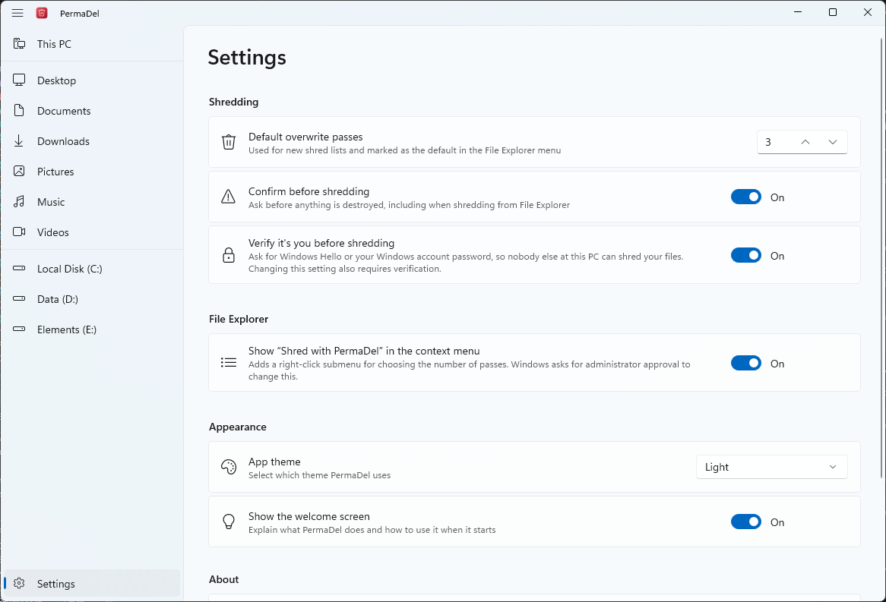

# PermaDel

[](https://github.com/lukastojiljkovic/PermaDel/actions/workflows/ci.yml)
[](https://github.com/lukastojiljkovic/PermaDel/releases/latest)
[](LICENSE)

PermaDel securely shreds files and folders on Windows, so they can't be brought back with undelete or file-recovery
tools. It's a native Windows 11 app built with WinUI 3 and the Windows App SDK.

<picture>
  <source media="(prefers-color-scheme: dark)" srcset="docs/images/main-dark.png">
  
</picture>

## Download

Get the installer from the [latest release](https://github.com/lukastojiljkovic/PermaDel/releases/latest). It needs
64-bit Windows 10 version 1809 or later, and Windows 11 for the File Explorer context menu.

The installer isn't code-signed, so Microsoft Defender SmartScreen may warn that the publisher is unknown. If you trust
the download, compare its SHA-256 hash with the one on the release page, then choose **More info** > **Run anyway**.

## Features

- **Native Windows 11 look.** Fluent controls, Mica backdrop and light, dark or system theme.
- **Built-in file browser.**
  - Browse drives and known folders with File Explorer-style back, forward, up and refresh buttons, including the same
    keyboard shortcuts and mouse back/forward buttons.
  - Select several items at once and add them to the shred list, or drag files and folders in from File Explorer.
- **File Explorer context menu.** Right-click files or folders and choose **Shred with PermaDel**. A submenu lets you
  pick the number of passes and warns that the action is permanent.
- **Identity verification.**
  - Optionally require Windows Hello (PIN, face or fingerprint) or the Windows account password before anything is
    shredded, so nobody else at an unlocked PC can use PermaDel to destroy your files.
  - Turning it on or off also requires verification, and the installer asks whether to enable it.
- **Configurable passes.** Choose 1–35 overwrite passes of cryptographically secure random data.
- **Settings:** default pass count, confirmation prompt, identity verification, context menu integration, theme and
  welcome screen, and the automatic update check.
- **Thorough destruction:**
  - every pass is flushed to the physical disk (`FlushFileBuffers`)
  - NTFS alternate data streams are overwritten too
  - files are truncated, renamed to random names several times and their timestamps are scrubbed before deletion
- **Safe by design:**
  - Nothing is modified until the whole selection has been scanned.
  - Symbolic links and junctions are removed without touching what they point to.
  - Files with other hard links are left untouched, because overwriting them would also destroy the data of the other
    links.
  - Online-only cloud files, such as OneDrive placeholders, are skipped instead of being downloaded and overwritten.
  - Every file system operation uses exact `\\?\` paths, so an item named `report.` or `.. ` is never mistaken for
    `report` or a parent folder.
  - Some locations are refused:
    - drive roots
    - Windows and Program Files
    - ProgramData
    - PermaDel's own folder
    - the user profile and its main folders (Desktop, Documents, Downloads, AppData and so on)

    This holds even when the location is reached through a junction, a mapped drive or a short name. Their contents can
    still be shredded.
  - Files that can't be shredded keep their original attributes.
  - A welcome screen explains what the app does, and a confirmation dialog appears before anything is destroyed.
- **Transparent.** Live progress with cancellation, plus a report listing every item that couldn't be shredded and why.
- **Wipe free space.** On a drive in This PC, write random data over all of the drive's free space and then remove it
  again, so files you deleted the ordinary way can't be read back. Your existing files are never touched. On NTFS, small
  files that live inside the file table can be overwritten too.
- **Remove metadata.** See what a JPEG, PNG or WebP photo, or a Word, Excel or PowerPoint file, holds — where a photo was
  taken, the camera, the author, the company and the rest — then write a cleaned copy next to it or replace the original.
  Pictures inside Office files are cleaned too, and a file is only written once the cleaned version passes a check.
- **Readable update notes.** PermaDel checks GitHub for a newer release when it starts (at most once a day) and from
  Settings, and shows what changed in plain words. After it updates, it shows that once, the next time you open it, but
  never when it was opened from the File Explorer menu.

By default, PermaDel asks before anything is destroyed, and checks it's you when verification is on:

<picture>
  <source media="(prefers-color-scheme: dark)" srcset="docs/images/confirm-dark.png">
  
</picture>

## How it works

PermaDel first scans every selected item, walking directory trees children-first. Then, for each file, it:

1. Clears read-only, hidden and system attributes.
2. Enumerates all data streams (`FindFirstStreamW`), including alternate data streams.
3. Overwrites each stream in place with random bytes from the OS CSPRNG, once per pass, flushing to disk after each pass.
4. Truncates the file to zero length, so the original size isn't recorded.
5. Renames it to random names several times and resets its timestamps, so the original name and dates are overwritten
   in the file system's metadata.
6. Deletes it.

Folders are renamed, scrubbed and deleted once they are empty. If any item inside a folder can't be shredded, the folder
is kept under its original name and the failure is reported. Renames and deletes are retried briefly, because
antivirus scanners and the search indexer often open files right after they're written.

### Wiping a drive's free space

Windows only marks a deleted file's space as free, so its contents stay on the disk until something overwrites them.
**Wipe free space**, on a drive in This PC, writes random data over every byte of that drive's free space and then
removes it again. PermaDel only ever creates and deletes one folder of its own at the root of the drive; nothing outside
it is written and existing files are never touched. The wipe keeps writing full-size files until the drive is full and
then halves each new file down to a single cluster, so the scattered gaps between files are covered too. On NTFS it can
also fill the file table's free entries, where small files live, with files whose contents fit inside the table itself.
The wipe folder is removed even when the wipe is cancelled or fails, and any wipe folder a crash left behind is removed
the next time PermaDel starts. While a wipe runs the drive is full for a moment, and on the Windows drive Windows and
other apps may slow down until it ends.

### Removing metadata

Photos and documents carry details their owner may not want to share: where a photo was taken, the camera, the author,
the company. For a selected JPEG, PNG or WebP photo, or a Word, Excel or PowerPoint file, PermaDel shows what the file
holds and then writes a cleaned version next to it (named `name (clean)`) or replaces the original. Each file is
rewritten byte for byte apart from the parts that carry metadata, so nothing is decoded or re-encoded and the picture or
document itself is unchanged. Inside Office files, the JPEG, PNG and WebP pictures in the document's media folders are
cleaned the same way, and the author, last-saved-by, company, manager and custom-properties parts are emptied or dropped.
A cleaned file is written to a temporary file and checked before it takes the place of the original, so a file that
can't be cleaned safely is left as it was.

### File Explorer integration

The Windows 11 context menu only hosts commands from apps that have package identity. PermaDel provides this through
a **sparse package**: an MSIX that contains nothing but a manifest and points at the install directory.

The command is a small native C++ COM server (`PermaDel.ShellExtension.dll`, `IExplorerCommand`) that File Explorer
loads in-process. When you pick a pass count, it starts `PermaDel.exe --shred <passes>` and streams the selected paths
to it over stdin.

The sparse package is unsigned, so Windows requires administrator approval to register it. The installer does this for
you, and the toggle in Settings asks for approval (UAC) when you change it.

### Identity verification

- **Windows Hello set up:** PermaDel asks Windows to verify the user with `UserConsentVerifier`.
- **Otherwise:** PermaDel shows the Windows Security prompt for the signed-in account and checks the password with
  `LogonUser`. It confirms that the password belongs to the account running PermaDel (by SID), then erases the password
  from memory.
- **Accounts without a password:** there is nothing to verify.

<picture>
  <source media="(prefers-color-scheme: dark)" srcset="docs/images/settings-dark.png">
  
</picture>

Verification stops someone at an unlocked PC from misusing PermaDel. It isn't a security boundary: that person could
still delete files with other tools or change PermaDel's settings in the registry.

## Verification

The unit tests (`tests/PermaDel.Core.Tests`) cover:

- pass limits
- protected locations, including device paths and locations reached through junctions
- random overwriting of every block
- read-only, hidden and system items
- alternate data streams
- paths longer than `MAX_PATH`
- names ending in a period or space, and names that look like `..`
- junctions and hard links
- online-only files
- nested selections
- locked files, which must keep their attributes
- missing paths
- cancellation
- wiping free space, including a volume that fills up, cancellation, and wipe folders a crash left behind
- reading and cleaning metadata in JPEG, PNG, WebP and Office files
- parsing release notes into user-facing groups

The forensic test checks the result on a real file system:

1. It creates a 64 MB NTFS virtual disk and writes marker data to it.
2. It shreds that data with one pass.
3. It detaches the disk and scans the raw disk image for the markers.

A control file removed with an ordinary delete must still be found; otherwise the scan proves nothing. On Windows 11
(build 26200), no copy of the shredded contents remains, and the original file name remains only in the NTFS
transaction log (see [Limitations](#limitations)).

```powershell
# From an elevated terminal: creating a virtual disk requires administrator rights
dotnet test tests/PermaDel.Core.Tests --filter Category=Forensics --logger "console;verbosity=detailed"
```

## Limitations

Overwriting a file in place is effective on traditional hard drives. No file-level shredder can guarantee destruction
in these situations:

- **SSDs, NVMe and flash media.** Wear leveling, TRIM and over-provisioning mean an overwrite may be written to
  different physical cells than the original data. For SSDs, use full-disk encryption (BitLocker) from the start, or the
  drive's secure erase / sanitize command when retiring it.
- **Copies elsewhere.** Other places can hold copies or fragments:
  - Volume Shadow Copies and System Restore points
  - backups
  - cloud sync, such as OneDrive
  - the Recycle Bin and application temp files
  - the page file and the hibernation file
- **File system journals.**
  - The NTFS transaction log (`$LogFile`) keeps recent metadata changes until newer file system activity overwrites
    them. The forensic test shows it can still hold the original file name.
  - The USN change journal, where enabled (typically on the system drive), also records file names.
- **NTFS-compressed or sparse files.** The file system may put rewritten data in newly allocated clusters.
- **Locked or privileged files.** Files that are in use or need administrator rights are skipped and reported. Close
  the owning application, or run PermaDel as administrator.

Wiping a drive's free space only reaches what a new file can be written over:

- **Solid-state drives and flash media.** The drive decides where writes land, so its spare cells are out of reach.
  For SSDs, BitLocker from the start is the reliable protection.
- **Space that is still in use.** Free space is only what is free now, so older copies held by System Restore points or
  Volume Shadow Copies, and the unused tail of existing files, are out of reach.
- **Which drives can be wiped.** PermaDel offers it on fixed and removable drives formatted NTFS, exFAT or FAT32, and
  only when the drive is writable.

Removing metadata has its own limits:

- **Some formats only.** JPEG, PNG and WebP photos, and Word, Excel and PowerPoint files. Anything else is listed as a
  kind PermaDel can't clean yet.
- **Inside Office files, only the pictures.** JPEG, PNG and WebP pictures in a document's media folders are cleaned, and
  the author, company and custom-properties parts are emptied or dropped. Other embedded files, such as videos, are left
  as they are.
- **Comments and tracked changes stay.** They are document content, and PermaDel leaves them in along with the names
  they carry. Remove them in the Office app first.
- **Orientation.** Removing a photo's metadata removes its orientation tag, so a photo that relied on it may show
  sideways in some apps.
- **The original's bytes.** Replacing an original, rather than keeping a copy, leaves its old bytes in the drive's free
  space until Windows reuses them. Wipe free space afterwards if they must not be recoverable.
- **Very large parts.** A document part that would expand past 256 MB is not read, so the file is left as it was and
  reported as one that could not be cleaned safely.

## Building

Requirements:

- Windows 10 1809 or later (the context menu needs Windows 11)
- the [.NET 8 SDK](https://dotnet.microsoft.com/download)
- Visual Studio or Build Tools with the **Desktop development with C++** workload, for the File Explorer extension
- [Inno Setup 6](https://jrsoftware.org/isinfo.php), for the installer

```powershell
# Run from source (the context menu is only available in installed builds)
dotnet run --project src/PermaDel -p:Platform=x64

# Run the unit tests
dotnet test tests/PermaDel.Core.Tests --filter "Category!=Forensics"

# Tests, self-contained publish, third-party licenses, extension, sparse package and installer
# -> artifacts/installer/PermaDel-<version>-Setup.exe
.\build.ps1
```

## Project structure

```text
src/PermaDel.Core            Shredding, free-space wiping and metadata cleaning (UI-independent, unit tested)
src/PermaDel                 WinUI 3 desktop app
src/PermaDel.ShellExtension  Native IExplorerCommand for the Windows 11 context menu + sparse package manifest
tests/PermaDel.Core.Tests    xUnit unit tests and the forensic virtual disk test
installer/PermaDel.iss       Inno Setup installer script
build.ps1                    Test, publish and package pipeline
```

## Legal

- [Terms of Use](TERMS.md). The installer asks you to accept them.
- [Privacy statement](PRIVACY.md). PermaDel collects no data; it reads the files you select only on your own PC, and the
  only request it makes itself is the update check.
- [Third-party notices](THIRD-PARTY-NOTICES.md)
- [Contributing](CONTRIBUTING.md): how to build, test and change the shredder safely
- [Code of Conduct](CODE_OF_CONDUCT.md)
- [Support](SUPPORT.md): where to ask
- [Product](PRODUCT.md): what PermaDel is for and who it is for
- [Design](DESIGN.md): the visual design system

Shredded data can't be recovered, and that is the point of this tool. Double-check your selection before you confirm.
The software is provided "as is", without warranty of any kind.

Windows is a trademark of the Microsoft group of companies. PermaDel isn't affiliated with or endorsed by Microsoft.

## License

[MIT](LICENSE) © 2026 Luka Stojiljkovic
